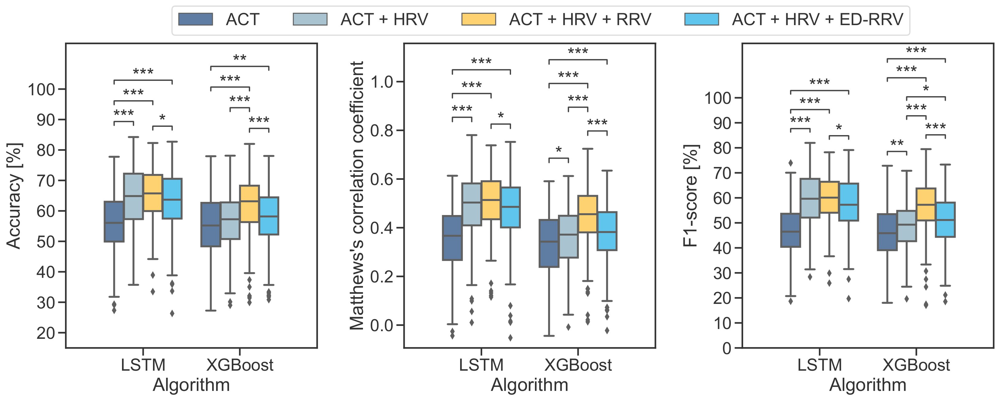
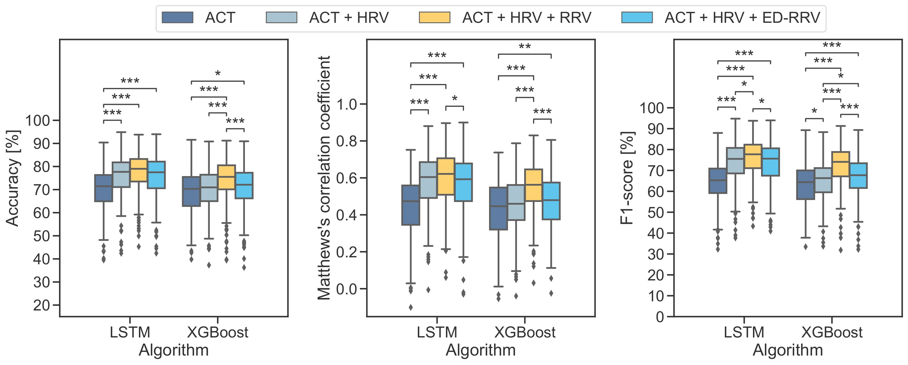
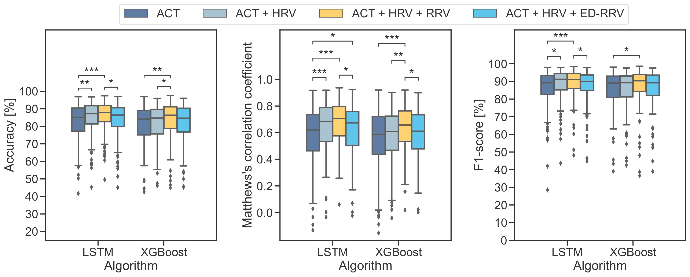

# Sleep-Analysis

## ML and DL-based Sleep stage classification using Actigraphy, Heart Rate Variability, and Respiratory Rate Variability
[](https://github.com/psf/black)


This repository contains a framework for the classification of sleep stages using different algorithms and modalities. <br>

Version for paper: Incorporating Respiratory Signals for ML-based Multi-Modal Sleep Stage Classification: A Large-Scale Benchmark Study with Actigraphy and HRV (https://doi.org/10.1093/sleep/zsaf091) on Tag: v0.1.0

The evaluation can be performed for three different classification schemes: <br>
- Multistage classification **(Wake / N1 / N2 / N3 / REM)** & **(Wake / NREM / REM)** <br>
- Binary classification **(Wake / Sleep)**.
<br>

## Supported Datasets
Sleep staging can be performed and evaluated on the following datasets: 
- [MESA Sleep dataset](https://sleepdata.org/datasets/mesa) [paper1](https://pubmed.ncbi.nlm.nih.gov/29860441/), [paper2](https://pubmed.ncbi.nlm.nih.gov/25409106/), which includes Polysomnography and wrist worn Actigraphy of more than 1,000 participants.
- EmpkinS D04 dataset [to be published], which includes Polysomnography with concurrent radar recordings.

## Transfer Learning
- This repository also includes a transfer learning approach to classify sleep stages on the EmpkinS D04 dataset using the MESA dataset as a source domain. <br>


## ECG derived respiration (EDR)
This Repository also includes Algorithms for the extraction of EDR signals from ECG signals. <br>
- Lindberg Algorithm [paper](https://link.springer.com/article/10.1007/BF02457833)
- Karlen Algorithm [paper](https://ieeexplore.ieee.org/document/6458992)
- Charlton Algorithm [paper](https://iopscience.iop.org/article/10.1088/0967-3334/37/4/610)
- AddisonAM Algorithm [paper](https://www.worldscientific.com/doi/abs/10.1142/S0219691304000329)
- AddisonFM Algorithm [paper](https://www.worldscientific.com/doi/abs/10.1142/S0219691304000329)
- Vangent Algorithm [paper](https://linkinghub.elsevier.com/retrieve/pii/S1369847818306740)
- Soni Algorithm [paper](https://www.ncbi.nlm.nih.gov/pmc/articles/PMC6329220/)
- Sakar Algorithm [paper](https://digital-library.theiet.org/content/conferences/10.1049/cp.2015.1654)

## Using the Framework
To run the algorithms on the datasets, the following steps are required:

1. Install the repository by using poetry (instructions below in the [getting startet](#getting-started) section).
2. Download the dataset (MESA: from [here](https://sleepdata.org/datasets/mesa)) and place it in a custom folder (e.g. `data/mesa`).
3. Create a folder for the processed data (e.g. `data/mesa_processed`).
4. Adjust the dataset paths and the processed path to the dataset in the [study_data.json](study_data.json) file.
5. Run the [data_handling.py](experiments/data_handling/data_handling.py) script to preprocess the data and extract the features.
6. Run the [algorithm_scripts](sleep_analysis/classification/algorithm_scripts) to run the algorithms.
7. The algorithms can be run with different parameters:
       - Specify the dataset you want to use for sleep staging
       - Enable / disable Transfer Learning
       - Select the modalities (actigraphy (ACT), heart rate variability (HRV), respiration rate variability (RRV), ECD-derived respiration rate variability (ED-RRV)).
       - The algorithms can also be run with custom combinations of modalities (e.g. ACT + HRV, ACT + RRV, ACT + HRV + RRV, ACT + HRV + RRV + ED-RRV, ...).
7. The jupyter notebooks in the [evaluation](experiments/evaluation) folder can be used to evaluate the results.


## Results for training and evaluation of the algorithms on the MESA dataset. <br>
Paper: Krauss et. al: [Incorporating Respiratory Signals for ML-based Multi-Modal Sleep Stage Classification: A Large-Scale Benchmark Study with Actigraphy and HRV](https://doi.org/10.1093/sleep/zsaf091) <br>

An overview of the full results can be in the following notebook: [results_notebook](experiments/evaluation/algorithm_modality_comparison/full_eval.ipynb). <br>
The evaluation of the single algorithms can be found in the following notebooks: [LSTM](experiments/evaluation/evaluation_per_algorithm/LSTM.ipynb), [TCN](experiments/evaluation/evaluation_per_algorithm/TCN.ipynb), [AdaBoost](experiments/evaluation/evaluation_per_algorithm/AdaBoost.ipynb), [MLP](experiments/evaluation/evaluation_per_algorithm/MLP.ipynb), [SVM](experiments/evaluation/evaluation_per_algorithm/SVM.ipynb), [Random Forest](experiments/evaluation/evaluation_per_algorithm/Random_Forest.ipynb), [XGBoost](experiments/evaluation/evaluation_per_algorithm/XGBoost.ipynb). <br>
### 5 stage classification (Wake / N1 / N2 / N3 / REM, according to AASM)


### 3 stage classification (Wake / NREM / REM)


### Binary classification (Wake / Sleep)



## Project structure

```
sleep-analysis
│   README.md
├── sleep-analysis  # The core library folder. All project-wide helper and algorithms go here
│   ├── classification  # Classification algorithms
│       ├── algrithm_scripts # Scripts to execute the classification algorithms
│       ├── deep_learning  # Contains the architecture of the deep learning algorithms (LSTM & TCN)
│       ├── heuristic_algorithms  # Heuristic algorithms
│       ├── ml_algorithms  # Contains the architecture of the Machine learning algorithms (AdaBoost, MLP, SVM, Random Forest, XGBoost)
│       ├── utils  # Helper functions for classification algorithms e.g. scoring
│   ├── datasets # TPCP Datasets
│   ├── feature_extraction # Feature extraction algorithms
|       ├── mesa_dataset # Feature extraction for the MESA dataset
│          ├── actigraphy.py # Actigraphy feature extraction algorithms
│          ├── hrv.py # Heart rate variability feature extraction algorithms
│          ├── imu.py # IMU feature extraction algorithms
│          ├── rrv.py # Respiratory rate variability feature extraction algorithms
│          ├── utils.py # Helper functions for feature extraction algorithms
│       ├── d04_main # Feature extraction for the EmpkinS D04 Radar dataset
│          ├── combine_clean.py # Combines the cleaned data from the EmpkinS D04 dataset
│          ├── hrv.py # Heart rate variability feature extraction algorithms
│          ├── rrv.py # Respiratory rate variability feature extraction algorithms
│          ├── movement.py # Movement feature extraction algorithms
│   ├── preprocessing # Preprocessing algorithms
│       ├── mesa_dataset # Preprocessing the MESA dataset
│          ├── edr_extraction
│              ├── base_extraction.py # Base class for the EDR extraction algorithms
│              ├── extraction_feature.py # Feature-based EDR-extraction
│              ├── extraction_filtered.py # Filter-based EDR-extraction
│              ├── extraction_nk.py # EDR-extraction of neurokit2 packackage
│          ├── preprocess_mesa.py # Combine preprocessing the MESA dataset in one file
│          ├── actigraphy.py # Preprocessing the actigraphy data
│          ├── ecg.py # Preprocessing the ECG data
│          ├── edr.py # Preprocessing the EDR data
│          ├── ground_truth.py # Preprocessing the sleep stage labels
│          ├── respiration.py # Preprocessing the respiration data
│          ├── utils.py # Helper functions for preprocessing algorithms
│       ├── d04_main # Preprocessing the EmpkinS D04 dataset
│          ├── preprocess_d04_movement.py # Subject-based logic to extract the movement datafrom the radar data
│          ├── movement.py # Preprocessing the movement data
│          ├── preprocess_d04_heart_sound.py # Subject-based logic to extract the heart sound data from the radar data
│          ├── heart_sound_radar.py # Preprocessing the heart sound data
│          ├── preprocess_d04_respiration.py # Subject-based logic to extract the respiration data from the radar data
│          ├── respiration_radar.py # Preprocessing the respiration data
│          ├── utils.py # Helper functions for preprocessing algorithms
│       ├── utils.py # Helper functions for preprocessing algorithms
├── experiments  # The main folder for all experiements. Each experiment has its own subfolder
|   ├── evaluation  # Contains the evaluation for the MESA-based sleep stage classification
|   |   ├── algorithm_modality_comparison  # Contains the evaluation of the algorithm and modality comparison
|   |   ├── baseline # Contains the computation of the baseline
|   |   ├── dataset_statistics # Contains the computation of the dataset statistics
|   |   ├── edr_extraction # Compares the extraction EDR to the respiration wave from the respiration belt
|   |   ├── evaluation_per_algorithm # Contains the evaluation of the algorithms in all the three experiments with a single notebook per algorithm
|   |   ├── feature_importance # Contains the computation of the feature importance for the XGBoost algorithm via SHAP 
|   |   ├── influences_on_classification performance # Illustartion of influences on the classification performance (e.g. gender, age, several diseases)
|   |   ├── latex_tables # Contains the automatically created latex tables for the paper
|   |
|   ├── data_hadling  # Contains the data handling for the preprocessing and feature extraction
|       ├── data_handling.py # Script to start the preprocessing and feature extraction
|
|   pyproject.toml  # The required python dependencies for the project
|   poetry.lock  # The frozen python dependencies to reproduce exact results
|   study_data.json  # The "hard-coded" path where to find the respective data. This needs to be manually adjusted for each user
|
```


## Getting started
### Installation

```
git clone https://mad-srv.informatik.uni-erlangen.de/empkins/analysis/D04/sleep-analysis.git
```


## For Developers

Install Python >=3.8 and [poetry](https://python-poetry.org).
Then run the commands below to get the latest source and install the dependencies:

```bash
git clone https://mad-srv.informatik.uni-erlangen.de/empkins/analysis/D04/sleep-analysis.git
git clone https://github.com/mad-lab-fau/BioPsyKit.git
git clone https://github.com/mad-lab-fau/mesa-data-importer.git
git clone https://github.com/empkins/empkins-io.git
git clone https://github.com/empkins/empkins-micro.git
```

Then enter the folder of the sleep-analysis project and run poetry
```
cd sleep-analysis
poetry install
```


### Working with the code

**Note**: In order to use jupyter notebooks with the project you need to register a new IPython 
kernel associated with the venv of the project (`poe conf_jupyter` - see below). 
When creating a notebook, make to sure to select this kernel (top right corner of the notebook).

To run any of the tools required for the development workflow, use the `poe` commands of the 
[poethepoet](https://github.com/nat-n/poethepoet) task runner:

```bash
$ poe
docs                 Build the html docs using Sphinx.
format               Reformat all files using black and isort.
lint                 Lint all files with Prospector.
test                 Run Pytest with coverage.
check                Run all checks (format, lint) - does not change the respective files.
update_version       Bump the version in pyproject.toml and empkins_io.__init__ .
conf_jupyter         Register a new IPython kernel named `sleep-analysis` linked to the virtual environment.
remove_jupyter       Remove the associated IPython kernel.
```

**Note**: The `poe` commands are only available if you are in the virtual environment associated with this project. 
You can either activate the virtual environment manually (e.g., `source .venv/bin/activate`) or use the `poetry shell` 
command to spawn a new shell with the virtual environment activated.

To add new dependencies you need for this repository:
```bash
poetry add <package_name>
```

To update dependencies after the `pyproject.toml` file was changed (It is a good idea to run this after a `git pull`):
```bash
poetry update
```

For more commands see the [official documentation](https://python-poetry.org/docs/cli/).

### Jupyter Notebooks

To use jupyter notebooks with the project you need to add a jupyter kernel pointing to the venv of the project.
This can be done by running:

```
poe conf_jupyter
```

Afterwards a new kernel called `sleep-analysis` should be available in the jupyter lab / jupyter notebook interface.
Use that kernel for all notebooks related to this project.


You should also enable nbstripout, so that only clean versions of your notebooks get committed to git

```
poe conf_nbstripout
```


All jupyter notebooks should go into the `notebooks` subfolder of the respective experiment.
To make best use of the folder structure, the parent folder of each notebook should be added to the import path.
This can be done by adding the following lines to your first notebook cell:

```python
# Optional: Auto reloads the helper and the main sleep-analysis module
%load_ext autoreload
%autoreload 2

from sleep-analysis import conf_rel_path
conf_rel_path()
```

This allows to then import the helper and the script module belonging to a specific experiment as follows:

```
import helper
# or
from helper import ...
```

### Format and Linting

To ensure consistent code structure this project uses prospector, black, and isort to automatically check the code format.

```
poe format  # runs black and isort
poe lint # runs prospector
```

If you want to check if all code follows the code guidelines, run `poe check`.
This can be useful in the CI context


### Tests

All tests are located in the `tests` folder and can be executed by using `poe test`.


### HPC
Coming soon!
HPC: export PATH=$PATH:'/home/hpc/iwso/YOUR-HPC-USERNAME/.local/bin'
